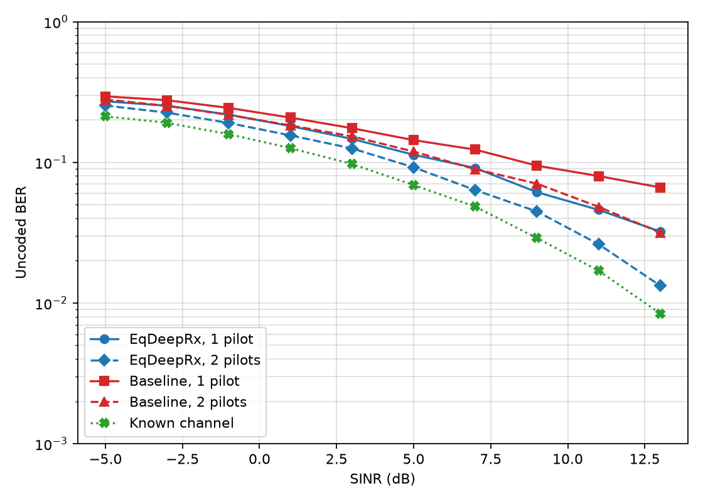

# EqDeepRx Reproduction

This repository is an independent PyTorch/Sionna reproduction of the primary receiver in [EqDeepRx: Learning a Scalable and Interference Mitigating MIMO Receiver](https://arxiv.org/abs/2602.11834v2). The implemented scope is the 64-QAM receiver and its uncoded BER evaluation; LDPC decoding, other decoder-dependent experiments, and ablations are outside this repository.

## Reproduced path

- Sionna 2.1 time-domain TR 38.901 channels with online UMa training and CDL-C evaluation.
- Learned DenoiseNN, parallel LMMSE/RZF equalization, shared per-layer DetectorNN, and DemapperNN.
- Paper-aligned loss, LAMB schedule, effective batch size 112, and 70,000 optimizer steps.
- Figure 6(a) protocol: three MIMO layers, one interferer, 10-15 m/s, two DMRS configurations, realized-SINR bins, and 32,000 validation slots total.

Validation slots are generated online by Sionna; no private or static test-set dump is distributed.

## Final result

The shipped checkpoint is `next_step=70000`. The final Figure 6(a) output uses seed 2026 and the protocol above.



The machine-readable source data are in [`figure6a_metrics.json`](results/figure6a_step70000/figure6a_metrics.json).

| Curve | -5 dB SINR | 13 dB SINR |
| --- | ---: | ---: |
| EqDeepRx, 1 pilot | 0.271517 | 0.032232 |
| EqDeepRx, 2 pilots | 0.253222 | 0.013283 |
| Baseline, 1 pilot | 0.294353 | 0.066320 |
| Baseline, 2 pilots | 0.279671 | 0.031654 |
| Known channel | 0.212328 | 0.008414 |

## Environment

```powershell
.\.venv\Scripts\python.exe -m pip install -r requirements-standard.txt
```

The verified environment uses Python 3.12, PyTorch 2.9.1+cu128, and Sionna 2.1.0. CUDA is required for the standard path.

Run a fast CPU smoke check without starting the paper-scale path:

```powershell
.\.venv\Scripts\python.exe scripts/preflight.py --tiny --device cpu
```

## Reproduce

Run the preflight checks before a new long run:

```powershell
.\.venv\Scripts\python.exe scripts/preflight.py --device cuda --microbatch-size 28 --generation-batch-size 2 --output outputs/preflight_standard.json
```

Start or resume the 70,000-step training run:

```powershell
.\.venv\Scripts\python.exe scripts/train.py --confirm-full-run --steps 70000 --batch-size 112 --microbatch-size 28 --generation-batch-size 2 --device cuda --seed 2026 --preflight-report outputs/preflight_standard.json --output checkpoints/eqdeeprx.pt
```

```powershell
.\.venv\Scripts\python.exe scripts/train.py --confirm-full-run --steps 70000 --batch-size 112 --microbatch-size 28 --generation-batch-size 2 --device cuda --seed 2026 --preflight-report outputs/preflight_standard.json --resume checkpoints/eqdeeprx.pt --output checkpoints/eqdeeprx.pt
```

Evaluate a completed checkpoint with the Figure 6(a) protocol:

```powershell
.\.venv\Scripts\python.exe scripts/evaluate_uncoded_ber.py --checkpoint checkpoints/eqdeeprx_step70000.pt --validation-samples 32000 --evaluation-batch-size 2 --device cuda --resume --output-dir outputs/figure6a_step70000
```

The evaluator writes `figure6a_metrics.json`, resumable progress, and `figure6a_uncoded_ber.png`.

## Reproduction boundary

This is a paper-aligned independent implementation, not a claim of bit-identical output to unavailable author-private code. The paper does not specify every implementation detail required for an executable reproduction; the choices used here are recorded in [`docs/paper_audit.md`](docs/paper_audit.md).

## Citation

Mikko Honkala, Dani Korpi, Elias Raninen, and Janne M. J. Huttunen, “EqDeepRx: Learning a Scalable and Interference Mitigating MIMO Receiver,” arXiv:2602.11834v2, 2026. <https://arxiv.org/abs/2602.11834v2>
